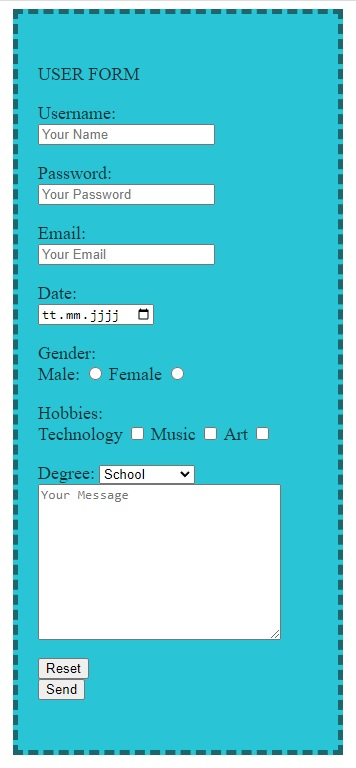

<!DOCTYPE html>
<html lang="en">
<head>
    <meta charset="UTF-8">
    <meta http-equiv="X-UA-Compatible" content="IE=edge">
    <meta name="viewport" content="width=device-width, initial-scale=1.0">
    <link href=' https://fonts.googleapis.com/css?family=Handlee' rel='stylesheet' type='text/css'>
    
</head>
<body>
    <h1>Form Example</h1>
    
   
</body>
</html>
